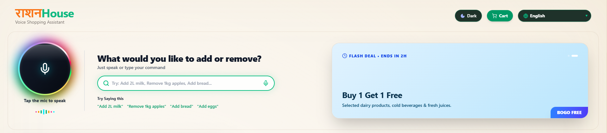
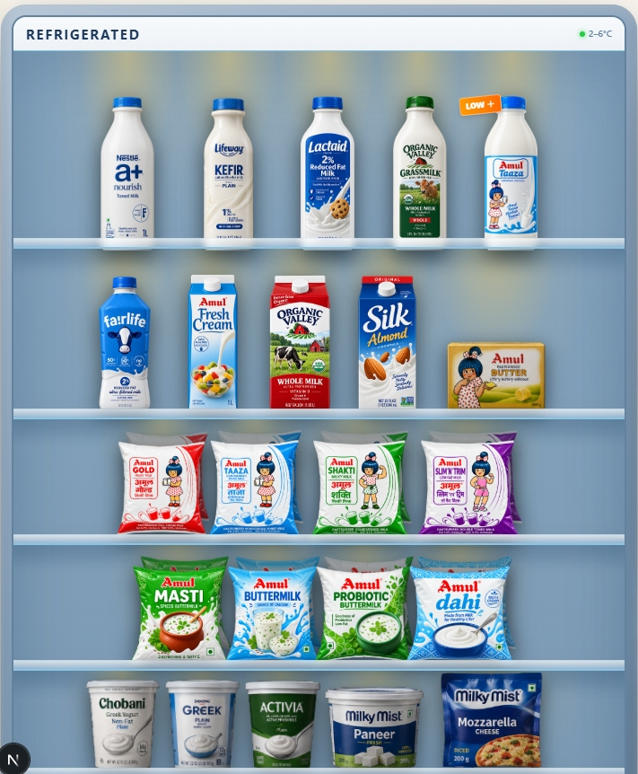
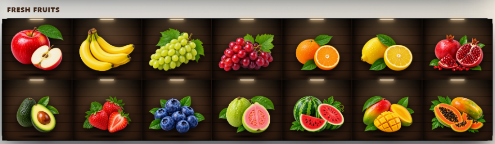

<div align="center">
  
</div>

<br />

# RashanHouse Voice Shopping Assistant

Welcome to the **RashanHouse Voice Shopping Assistant** – a next-generation, premium e-commerce platform that reimagines grocery shopping with a voice-first approach. 

RashanHouse combines a beautiful, warm, minimalist design with powerful Voice Command Recognition and Natural Language Processing (NLP). Instead of manually searching, clicking, and adjusting quantities, users can simply tap the central glowing microphone and naturally speak their grocery needs. The assistant handles the rest—instantly adding items to the cart, automatically sorting them into categories, and suggesting relevant running-low items based on smart historical data.

The user interface feels like walking through a beautifully organized digital supermarket. From the chilled refrigerated section to the fresh produce aisles, the visual experience is designed to be as premium as it is accessible.

---

## 📸 Sneak Peek

<div align="center">
  
  
</div>
<br />
<div align="center">
  
  
</div>

---

## ✨ Features & Technical Highlights

### 1. Advanced Voice Input
- **Voice Command Recognition:** Allow users to effortlessly add items to their shopping list using completely hands-free voice commands (e.g., *"Add milk"*, *"I need apples"*).
- **Natural Language Processing (NLP):** Powered by an intelligent AI layer that processes varied, conversational user phrases for maximum flexibility (e.g., it understands both *"I want to buy bananas"* and *"Add bananas to my list"* perfectly).
- **Multilingual Support:** Ready to scale with voice commands supported across multiple languages, ensuring inclusivity and ease of use.

### 2. Smart AI Suggestions
- **Predictive Product Recommendations:** Based on previous shopping history and consumption data, the assistant predicts and suggests items that the user is likely running low on (e.g., *"It looks like you're running low on bread"*).
- **Seasonal Recommendations:** Intelligently curates and highlights items that are currently in season or on a flash sale.
- **Contextual Substitutes:** Offers smart alternatives if a product is unavailable, or proactively suggests preferred options (e.g., if you frequently buy almond milk, it might suggest almond milk when you just say "milk").

### 3. Shopping List Management
- **Add/Remove Capabilities:** Add, remove, or modify existing items purely through voice commands (e.g., *"Remove milk from my list"*).
- **Automatic Categorization:** Automatically groups and categorizes items logically in the cart (e.g., Dairy, Produce, Snacks) for better visual organization and faster checkout.
- **Smart Quantity Parsing:** Precisely parses and specifies quantities spoken naturally by the user (e.g., *"Add 2 bottles of water"* or *"Buy 5 oranges"*).

### 4. Voice-Activated Search
- **Faceted Item Search:** Allow users to find specific items by voice, including fine-grained details like brand names, sizes, or specific types (e.g., *"Find me organic apples"*).
- **Intelligent Price & Brand Filtering:** Voice-based filtering allows for complex constraints right from the search phrase (e.g., *"Find toothpaste under $5"*).

### 5. Premium UI/UX Design
- **Minimalist, Warm Interface:** A highly polished, easy-to-use interface built with a specific beige/warm theme that evokes a welcoming "home" feel, ensuring the shopping list and products take center stage.
- **Dynamic Visual Feedback:** A continuous RGB orbit microphone, interactive hover cards, and real-time visual confirmations ensure users are always in sync with their voice actions.
- **Responsive & Voice-Optimized:** Built and strictly optimized for smooth performance across mobile devices and hands-free, voice-only interactions.

---

## 🚀 Getting Started

First, run the development server:

```bash
npm run dev
# or
yarn dev
# or
pnpm dev
# or
bun dev
```

Open [http://localhost:3000](http://localhost:3000) with your browser to see the application in action.
